## Mimar WebSitesi
 * Bu Depoda Full Stack Web Geliştirme eğitimi kapsamında geliştirdiğimiz **Mimar Websitesi** projenin farklı yöntemlerle uygulanmış halini bulabilirsiniz.
 * Can Boz hocama verdiği eğitimler için teşekkür ederim.

## Bu Depodaki Proje İçeriği
 * Display ile Mimar Projesi
 * Flexbox ile Mimar Projesi
 * CSS Grid ile Mimar Projesi
    
    

## Website Görselleri
Photo 1 | Photo 2 | Photo 3 | Photo 4 | Photo 5 | Photo 6 |
------------ | ------------ | ------------ | ------------ | ------------ | ------------ | 
 |  |  |  | 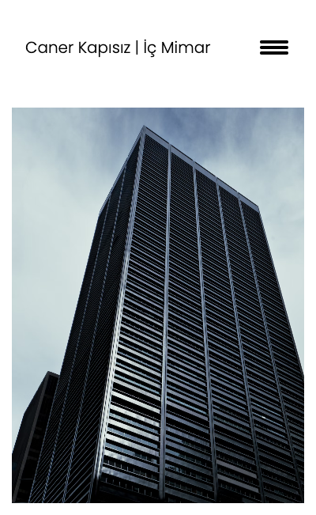 | 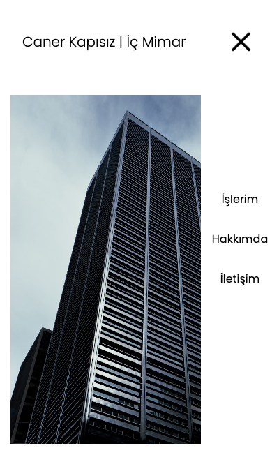 |
CSS Grid | CSS Grid | CSS Grid | CSS Grid | CSS Grid | 
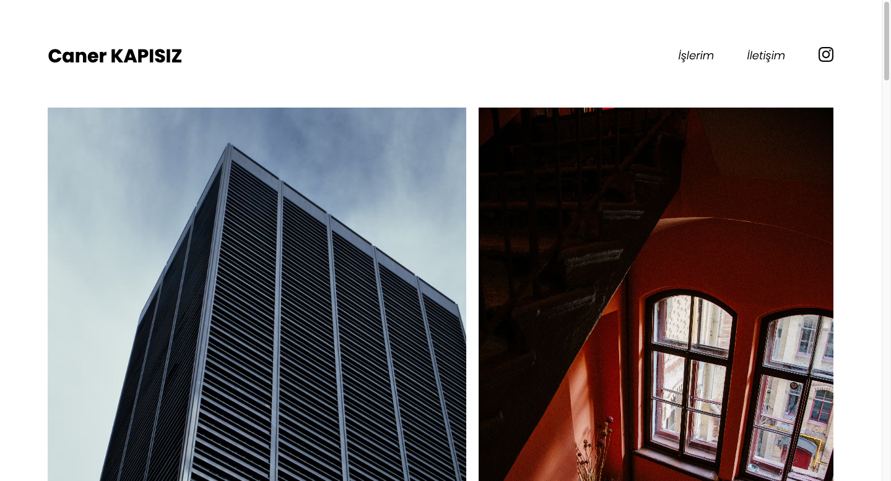 | 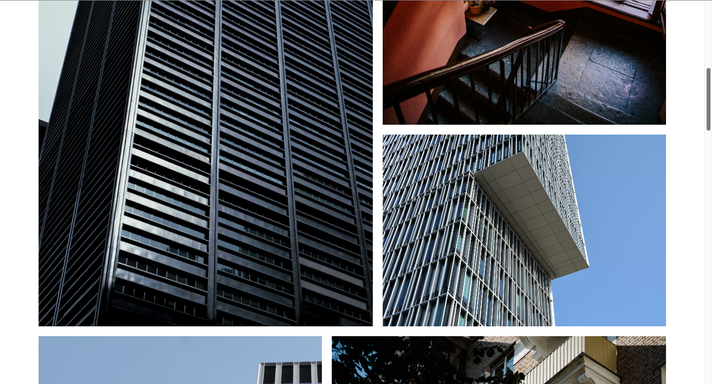 | 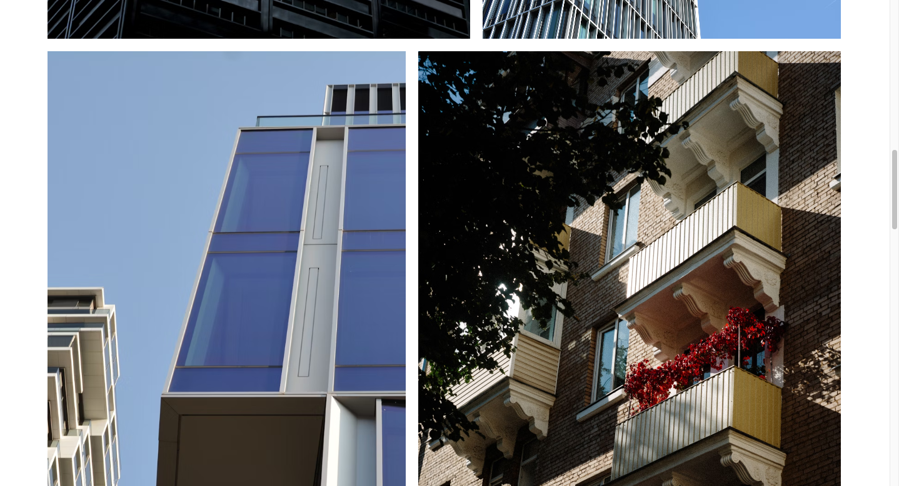 | 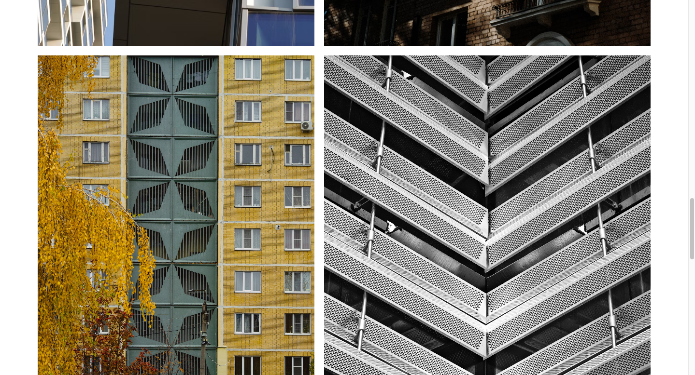 | 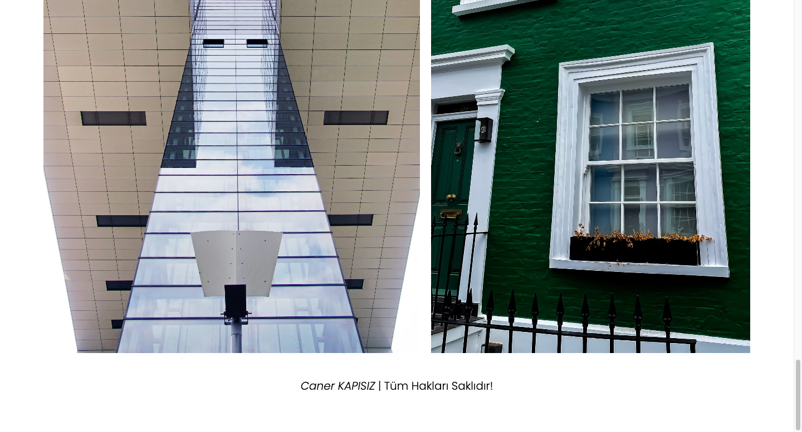 | 
CSS Grid Responsive | CSS Grid Responsive | CSS Grid Responsive | CSS Grid Responsive | 
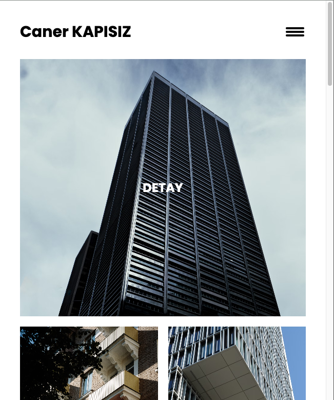 | 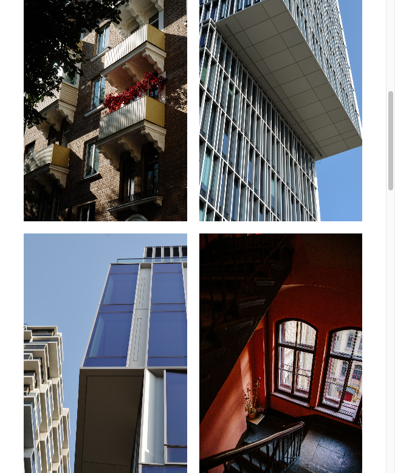 | 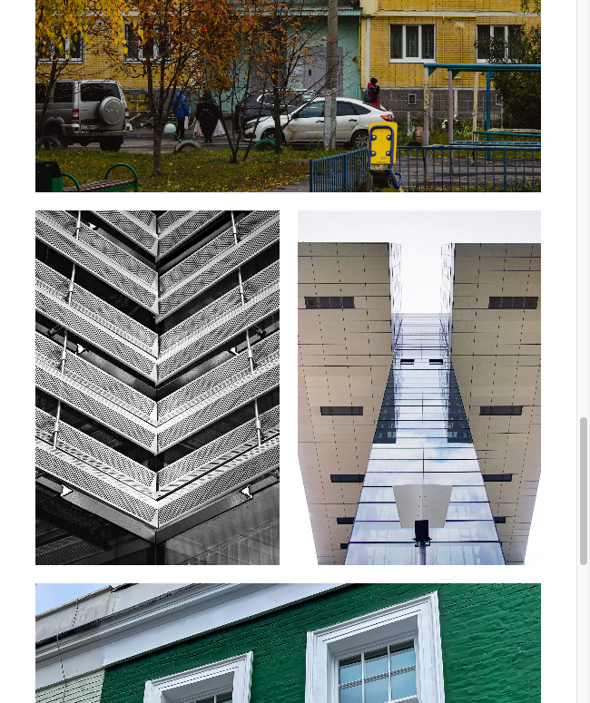 | 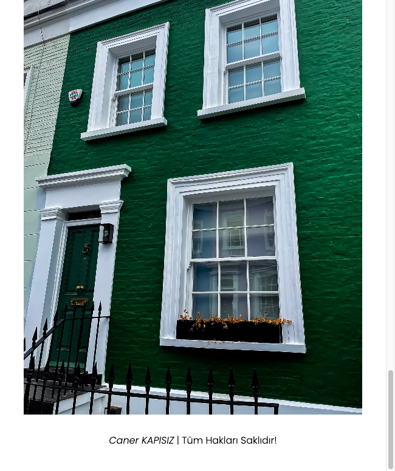 | 
